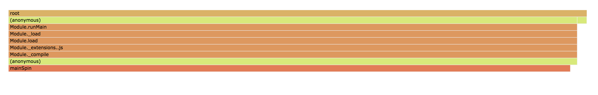

# Support for profiling inside worker-threads

Tried on OSX node 12.6.0 and 11.15.0

## Running node build-in profiler

```
node --experimental-worker --prof node-prof.js
```

Produces 2 isolate files, you can check that both functions were recorded by running:

```
cat isolate* | grep Spin

code-creation,LazyCompile,10,77539,0x1d090089cbee,57,mainSpin ./node-and-workers-on-demand-profiler/node-prof.js:3:18,0x1d094afe0bb8,~
code-creation,LazyCompile,0,80529,0x940d95c3ca0,576,mainSpin ./node-and-workers-on-demand-profiler/node-prof.js:3:18,0x1d094afe0bb8,*
code-creation,LazyCompile,10,35928,0x350387ff20ce,57,workerSpin [worker eval]:2:20,0x350387ff1630,~
code-creation,LazyCompile,0,37921,0x1be758583660,576,workerSpin [worker eval]:2:20,0x350387ff1630,*
```

## Running pprof on only main thread

```
node --experimental-worker pprof-main.js
pprof -http=: wall.pb.gz
```

Seems to not contain `workerSpin()` function.



## Running pprof on worker thread

```
node --experimental-worker pprof-worker.js
(node:96547) UnhandledPromiseRejectionWarning: TypeError: process._startProfilerIdleNotifier is not a function
    at start (./node-and-workers-on-demand-profiler/node_modules/pprof/out/src/time-profiler.js:52:13)
    at Object.<anonymous> (./node-and-workers-on-demand-profiler/node_modules/pprof/out/src/time-profiler.js:33:22)
    at Generator.next (<anonymous>)
    at ./node-and-workers-on-demand-profiler/node_modules/pprof/out/src/time-profiler.js:22:71
    at new Promise (<anonymous>)
    at __awaiter (./node-and-workers-on-demand-profiler/node_modules/pprof/out/src/time-profiler.js:18:12)
    at Object.profile (./node-and-workers-on-demand-profiler/node_modules/pprof/out/src/time-profiler.js:32:12)
    at a ([worker eval]:5:38)
    at [worker eval]:15:1
    at Script.runInThisContext (vm.js:123:20)
(node:96547) UnhandledPromiseRejectionWarning: Unhandled promise rejection. This error originated either by throwing inside of an async function without a catch block, or by rejecting a promise which was not handled with .catch(). (rejection id: 2)
(node:96547) [DEP0018] DeprecationWarning: Unhandled promise rejections are deprecated. In the future, promise rejections that are not handled will terminate the Node.js process with a non-zero exit code.
```

## Running pprof on both main and worker thread

This ends up in the following error:

```
node --experimental-worker pprof-worker-main.js

events.js:180
      throw er; // Unhandled 'error' event
      ^
internal/modules/cjs/loader.js:817
  return process.dlopen(module, path.toNamespacedPath(filename));
                 ^

Error: Module did not self-register.
    at Object.Module._extensions..node (internal/modules/cjs/loader.js:817:18)
    at Module.load (internal/modules/cjs/loader.js:643:32)
    at Function.Module._load (internal/modules/cjs/loader.js:556:12)
    at Module.require (internal/modules/cjs/loader.js:683:19)
    at require (internal/modules/cjs/helpers.js:16:16)
    at Object.<anonymous> (./node-and-workers-on-demand-profiler/node_modules/pprof/out/src/heap-profiler-bindings.js:21:18)
    at Module._compile (internal/modules/cjs/loader.js:776:30)
    at Object.Module._extensions..js (internal/modules/cjs/loader.js:787:10)
    at Module.load (internal/modules/cjs/loader.js:643:32)
    at Function.Module._load (internal/modules/cjs/loader.js:556:12)
Emitted 'error' event at:
    at Worker.[kOnErrorMessage] (internal/worker.js:176:10)
    at Worker.[kOnMessage] (internal/worker.js:186:37)
    at MessagePort.<anonymous> (internal/worker.js:118:57)
    at MessagePort.emit (events.js:203:13)
    at MessagePort.onmessage (internal/worker/io.js:70:8)
```
